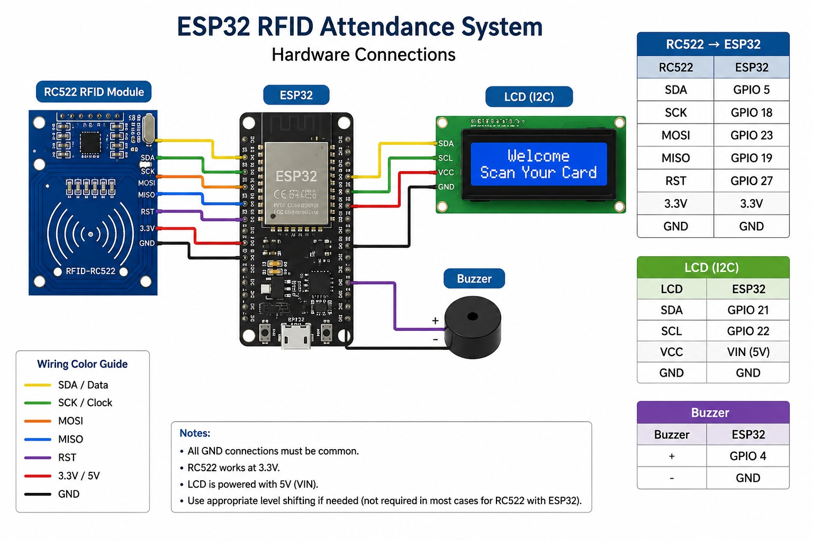
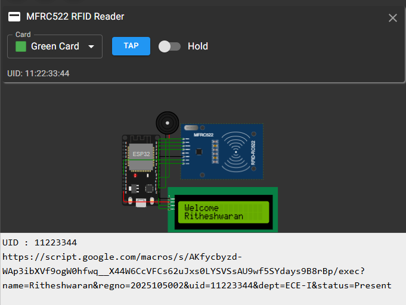
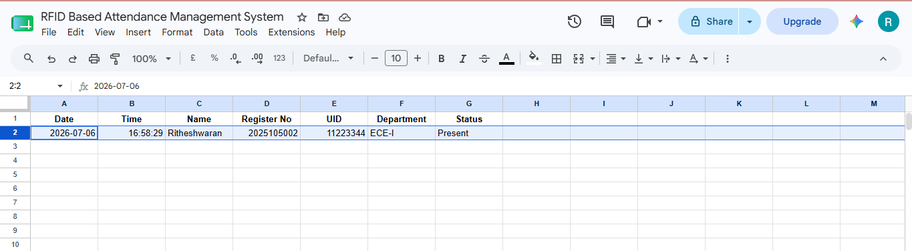

# RFID-Based Smart Attendance Management System Using ESP32

<p align="center">


</p>

---

## 📖 Overview

The **RFID-Based Smart Attendance Management System** is an IoT project designed to automate attendance recording using RFID technology and cloud storage.

Each student is assigned an RFID card with a unique UID. When the card is scanned, the ESP32 verifies the UID, displays the student's information on an LCD, provides buzzer feedback, and uploads the attendance record to **Google Sheets** using **Google Apps Script** over Wi-Fi.

This project demonstrates the integration of **Embedded Systems**, **IoT**, and **Cloud Computing** into a practical attendance management solution.

---

## 📌 Project Status

> ✅ Functional on real ESP32 hardware  
> ⚠️ Cloud communication cannot be fully demonstrated in Wokwi due to HTTPS limitations.

---

# ✨ Features

- 📡 ESP32 Wi-Fi Connectivity
- 📇 RFID-Based Student Authentication
- ☁️ Real-Time Google Sheets Integration
- 📺 16×2 LCD Display
- 🔔 Buzzer Notifications
- 🚫 Duplicate Attendance Prevention
- ⚡ Fast Attendance Recording
- 💰 Low-Cost Hardware
- 📊 Cloud-Based Attendance Storage

---

# 🛠 Technologies Used

- ESP32 DevKit V1
- MFRC522 RFID Module
- Arduino IDE
- Google Apps Script
- Google Sheets
- Wi-Fi
- Wokwi Simulator

---

# 🏗 System Architecture

```text
              RFID Card
                  │
                  ▼
        MFRC522 RFID Reader
                  │
                  ▼
               ESP32
        ┌────────┼────────┐
        │        │        │
        ▼        ▼        ▼
      LCD     Buzzer    Wi-Fi
                            │
                            ▼
                 Google Apps Script
                            │
                            ▼
                     Google Sheets
```

---

# 📷 Circuit Diagram


<p align="center">

</p>

---

# 🎥 Demonstration

## Hardware Setup

🚧 **Prototype Under Development**

The hardware prototype is currently being assembled and tested.

Hardware photographs will be added after:
- Circuit assembly
- Functional testing
- Prototype validation

---

## LCD Output


<p align="center">

</p>

---

## Google Sheets Output


<p align="center">

</p>

---

# 🌐 Live Simulation

The hardware logic of this project can be explored using the Wokwi simulator.


> **Note:** Due to HTTPS/TLS limitations in the Wokwi simulator, uploading attendance to Google Sheets cannot be fully demonstrated. The cloud integration has been verified separately on real ESP32 hardware.

🔗 **Wokwi Project:**  
 https://wokwi.com/projects/468725509737183233

---

# 🛠 Hardware Components

| Component | Quantity | Purpose |
|------------|----------|---------|
| ESP32 DevKit V1 | 1 | Main Controller |
| MFRC522 RFID Reader | 1 | RFID Reader |
| RFID Cards | Multiple | Student Identification |
| 16×2 LCD (I2C) | 1 | Display Messages |
| Active Buzzer | 1 | Audio Feedback |
| Breadboard | 1 | Prototyping |
| Jumper Wires | As Required | Connections |

---

# 💻 Software Requirements

- Arduino IDE
- ESP32 Arduino Core
- Google Apps Script
- Google Sheets
- Wokwi Simulator

---

# 📚 Required Arduino Libraries

Install these libraries using the **Arduino Library Manager**.

- MFRC522
- LiquidCrystal_I2C
- WiFi
- HTTPClient
- SPI

---

# 🔌 Hardware Connections

## RC522 → ESP32

| RC522 | ESP32 |
|--------|--------|
| SDA | GPIO 5 |
| SCK | GPIO 18 |
| MOSI | GPIO 23 |
| MISO | GPIO 19 |
| RST | GPIO 27 |
| 3.3V | 3.3V |
| GND | GND |

---

## LCD (I2C)

| LCD | ESP32 |
|------|--------|
| SDA | GPIO 21 |
| SCL | GPIO 22 |
| VCC | VIN (5V) |
| GND | GND |

---

## Buzzer

| Buzzer | ESP32 |
|---------|--------|
| + | GPIO 4 |
| - | GND |

---

# ⚙️ Working Principle

1. ESP32 powers on.
2. Connects to Wi-Fi.
3. LCD displays **Scan RFID Card**.
4. RFID card is scanned.
5. ESP32 reads the UID.
6. Searches the student database.
7. Validates the student.
8. Displays student name.
9. Sends attendance to Google Apps Script.
10. Google Apps Script stores attendance in Google Sheets.
11. LCD confirms attendance.
12. System waits for the next RFID card.

---

# 🔄 Flowchart

```text
Power ON
     │
Connect Wi-Fi
     │
Scan RFID Card
     │
Read UID
     │
     ▼
Is UID Valid?
 ┌──────────────┐
 │              │
YES            NO
 │              │
 ▼              ▼
Display Name  Invalid Card
 │              │
 ▼              ▼
Upload Data  Long Beep
 │
 ▼
Google Sheets
 │
 ▼
Attendance Recorded
 │
 ▼
Short Beep
 │
 ▼
Wait for Next Card
```

---

# 🧑‍🎓 Student Database

| UID | Name | Register No | Department |
|------|------|-------------|------------|
| 01020304 | Sivadhinesh | 2025105001 | ECE-I |
| 11223344 | Ritheshwaran | 2025105002 | ECE-I |
| 55667788 | Altaf Hussain | 2025105003 | ECE-J |
| AABBCCDD | Chandru | 2025105004 | ECE-J |
| 04112233 | Akash | 2025105005 | ECE-I |
| C0FFEE99 | Chinmaiyi | 2025105006 | ECE-J |

---

# ☁️ Google Apps Script

The Google Apps Script acts as the bridge between the ESP32 and Google Sheets.

It receives:

- Student Name
- Register Number
- UID
- Department
- Status
- Date
- Time

The script also checks for duplicate attendance before inserting a new record.

---

# 📊 Sample Google Sheet

| Date | Time | Name | Register No | UID | Department | Status |
|------|------|------|-------------|-----|------------|--------|
| 2026-07-05 | 09:12:21 | Shyamcharan | 2025105501 | 6AB21893 | ECE-J | Present |

---

# 📺 LCD Messages

### Startup

```text
RFID Attendance
Connecting...
```

### Ready

```text
Scan RFID Card
```

### Valid Card

```text
Welcome
Student Name
```

### Attendance Recorded

```text
Attendance
Recorded
```

### Duplicate

```text
Already
Marked
```

### Invalid Card

```text
Invalid
Card
```

---

# 🔔 Buzzer Indications

| Event | Sound |
|--------|--------|
| Startup | Short Beep |
| Attendance Recorded | Short Beep |
| Already Marked | Two Short Beeps |
| Invalid Card | Long Beep |

---

# 📂 Repository Structure

```text
RFID-Smart-Attendance-System
│
├── firmware
│   ├── RFID_Smart_Attendance.ino
│   ├── config.h.example
│   └── secrets.h.example
│
├── google-apps-script
│   └── Code.gs
│
├── hardware
│   ├── Components.md
│   └── Wiring.md
│
│
├── images
│   ├── hardware_setup.jpeg
│   ├── lcd_output.png
|   ├── Circuit_Diagram.png
│   └── google_sheet_output.png
│   
├── wokwi
│   └── README.md
│
├── README.md
├── LICENSE
└── .gitignore
```

---

# 🚀 Installation

## 1. Clone the Repository

```bash
git clone https://github.com/LinkwithRithesh/RFID-Smart-Attendance-System.git
```

---

## 2. Install Required Libraries

Install all libraries listed above using the Arduino Library Manager.

---

## 3. Configure Wi-Fi

Copy:

```text
firmware/secrets.h.example
```

Rename it to:

```text
secrets.h
```

Update:

```cpp
#define WIFI_SSID "YOUR_WIFI_NAME"
#define WIFI_PASSWORD "YOUR_WIFI_PASSWORD"
```

---

## 4. Configure Google Apps Script

Copy:

```text
firmware/config.h.example
```

Rename it to:

```text
config.h
```

Update:

```cpp
#define SCRIPT_URL "YOUR_GOOGLE_APPS_SCRIPT_URL"
```

---

## 5. Upload the Firmware

- Select **ESP32 Dev Module**
- Select the correct COM Port
- Click **Upload**

---

# ⚠️ Known Issues

- HTTPS communication may fail inside the Wokwi simulator.
- Google Apps Script has been verified using a web browser.
- The issue is simulator-specific and does not affect real ESP32 hardware.

---

# 🌟 Future Enhancements

- Admin panel for student registration
- Dynamic student database
- Firebase Integration
- Attendance Dashboard
- Student Mobile Application
- Email/SMS Notifications
- Face Recognition
- Fingerprint Authentication

---

# 🤝 Contributing

Contributions are welcome.

If you'd like to improve the project:

1. Fork the repository.
2. Create a new branch.
3. Commit your changes.
4. Open a Pull Request.

---

# 🙏 Acknowledgements

- Espressif Systems (ESP32)
- Arduino
- Wokwi
- Google Apps Script
- Google Sheets
- MFRC522 Arduino Library contributors

---

# 📜 License

This project is licensed under the **MIT License**.

See the LICENSE file for details.
---

# 👨‍💻 Author

**Ritheshwaran A**

Electronics and Communication Engineering (ECE)

College of Engineering Guindy  
Anna University, Chennai

GitHub: https://github.com/LinkwithRithesh

---

## ⭐ Support

If you found this project useful, consider giving it a **Star ⭐** on GitHub.