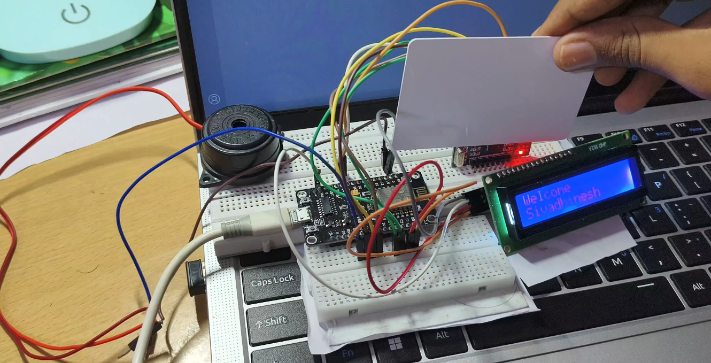
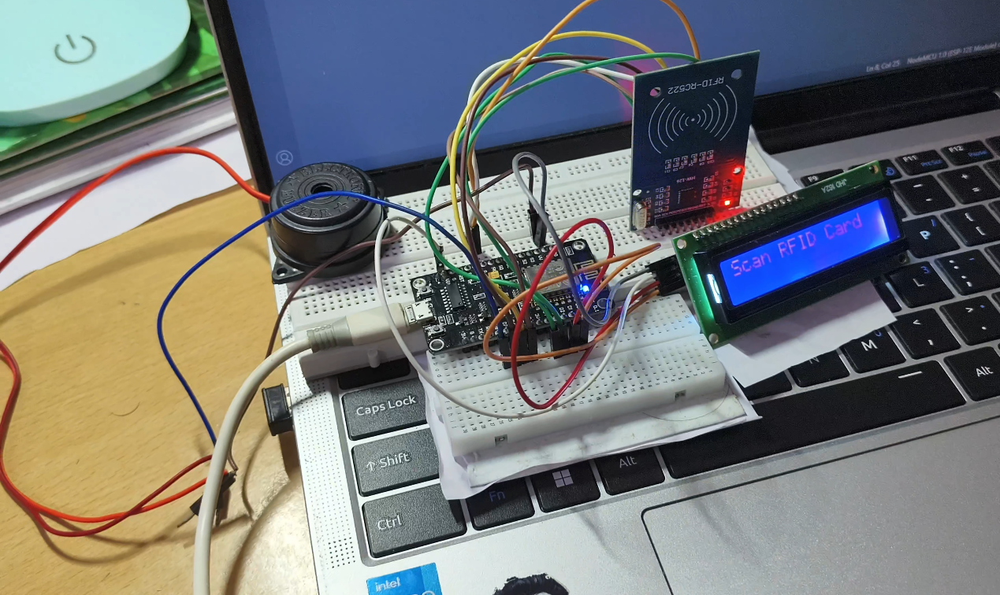

<div align="center">

# 📡 RFID-Based Smart Attendance Management System

### An IoT-Based Smart Attendance System Using **NodeMCU ESP8266**, **MFRC522 RFID**, **Google Apps Script**, and **Google Sheets**



---


</div>

---

# 📖 Overview

The **RFID-Based Smart Attendance Management System** is an Internet of Things (IoT) project that automates student attendance using **RFID technology**, **Wi-Fi connectivity**, and **Google Cloud services**.

Each student is assigned a unique RFID card. When the card is scanned, the system authenticates the UID, retrieves the corresponding student information, provides visual and audible feedback, and uploads the attendance record to **Google Sheets** through **Google Apps Script**.

Unlike traditional attendance methods, this system minimizes manual effort, prevents duplicate attendance entries, and maintains attendance records securely in the cloud.

---

## 📑 Table of Contents

- [Overview](#-overview)
- [Key Features](#-key-features)
- [Project Demonstration](#-project-demonstration)
- [System Architecture](#️-system-architecture)
- [Technology Stack](#️-technology-stack)
- [Hardware Components](#️-hardware-components)
- [Getting Started](#-getting-started)
- [Google Apps Script Deployment](#️-google-apps-script-deployment)
- [Wokwi Simulation](#-wokwi-simulation)
- [Results](#-results)
- [Future Enhancements](#-future-enhancements)
- [Contributing](#-contributing)
- [License](#-license)
- [Author](#-author)

---

# ✨ Key Features

- 📇 RFID-based student identification
- 📡 Wi-Fi enabled attendance synchronization
- ☁️ Real-time Google Sheets integration
- 📺 16×2 I2C LCD status display
- 🔔 Buzzer notifications
- 🚫 Duplicate attendance prevention
- 🌐 Google Apps Script cloud backend
- 📶 Automatic Wi-Fi reconnection
- 📤 Automatic retry for failed attendance uploads
- 📁 Offline queue support during network interruptions
- ⚡ Fast RFID authentication
- 💰 Low-cost and easy-to-build hardware
- 🔧 Open-source firmware
- 🧩 Modular project structure
- 🎮 Wokwi simulation included

---

# 📌 Project Status

| Module | Status |
|---------|--------|
| RFID Authentication | ✅ Completed |
| LCD Interface | ✅ Completed |
| Wi-Fi Connectivity | ✅ Completed |
| Google Apps Script Integration | ✅ Completed |
| Google Sheets Logging | ✅ Completed |
| Duplicate Detection | ✅ Completed |
| Hardware Prototype | ✅ Completed |
| ESP8266 Firmware | ✅ Completed |
| Wokwi Simulation | ✅ Completed |
| Documentation | ✅ Completed |

---

# 🚀 Project Highlights

- **Physical Hardware:** NodeMCU ESP8266
- **Simulation Platform:** ESP32 DevKit V1 (Wokwi)
- **Communication Protocol:** HTTPS over Wi-Fi
- **Cloud Backend:** Google Apps Script
- **Database:** Google Sheets
- **RFID Frequency:** 13.56 MHz (MFRC522)
- **Programming Language:** C++ (Arduino Framework)
- **Simulation Tool:** Wokwi

> **Note**
>
> The physical implementation of this project is built using a **NodeMCU ESP8266**.  
> The **ESP32 DevKit V1** is used exclusively for the Wokwi simulation because it offers better peripheral support within the simulator. The application logic remains identical, with only the GPIO assignments differing between the simulation and the hardware implementation.

---

# 🎯 Objectives

- Replace manual attendance with RFID-based automation.
- Eliminate duplicate attendance entries.
- Store attendance securely in the cloud.
- Provide instant user feedback through an LCD and buzzer.
- Demonstrate the integration of Embedded Systems, IoT, and Cloud Computing.
- Build a scalable and cost-effective attendance solution suitable for educational institutions.

---

# 🏆 Project Demonstration

## Hardware Prototype

<p align="center">

</p>

> **Actual hardware implementation using NodeMCU ESP8266, MFRC522 RFID Reader, 16×2 I2C LCD, and Active Buzzer.**

---

## System Demonstration

<p align="center">

</p>

> **Demonstration of the complete RFID attendance workflow.**

---

## Circuit Diagram

<p align="center">

</p>

---

## LCD Output

<p align="center">

</p>

---

## Google Sheets Output

<p align="center">

</p>

---

## 🎥 Project Demonstration

A complete demonstration of the project, including hardware operation and cloud attendance logging, is available below.

🔗 **Demo Videos:**  
https://drive.google.com/drive/folders/1vw_WvM3Md_eeNigcoZ_DopTGOFYCARBb

---

# 🏗️ System Architecture

The RFID-Based Smart Attendance Management System integrates embedded hardware with cloud services to automate attendance recording. The system authenticates RFID cards, displays attendance status locally, and synchronizes records with Google Sheets over Wi-Fi.

```text
                     RFID Card / Tag
                            │
                            ▼
                  MFRC522 RFID Reader
                            │
                         SPI Interface
                            │
                            ▼
                    NodeMCU ESP8266
          ┌─────────────┼─────────────┐
          │             │             │
          ▼             ▼             ▼
     16×2 I2C LCD    Buzzer      Wi-Fi Module
                                          │
                                          ▼
                              Google Apps Script
                                          │
                                          ▼
                                  Google Sheets
```

---

# ⚙️ Working Principle

The attendance system follows the workflow below:

1. The NodeMCU ESP8266 initializes all peripherals.
2. The system connects to the configured Wi-Fi network.
3. The LCD displays **"Scan RFID Card"**.
4. A student places an RFID card near the MFRC522 reader.
5. The RFID reader extracts the card's UID.
6. The firmware compares the UID against the locally stored student database.
7. If the UID is valid:
   - Student details are retrieved.
   - The LCD displays the student's name.
   - A confirmation beep is generated.
8. Attendance data is transmitted securely to Google Apps Script over HTTPS.
9. Google Apps Script validates duplicate entries for the current day.
10. Attendance is stored in Google Sheets if no duplicate is found.
11. The LCD displays the final attendance status.
12. The system returns to waiting for the next RFID card.

---

# 🔄 Communication Flow

```text
RFID Card
     │
     ▼
MFRC522 Reader
     │
     ▼
NodeMCU ESP8266
     │
     ├────────────► LCD Display
     │
     ├────────────► Buzzer
     │
     ▼
Wi-Fi Network
     │
     ▼
Google Apps Script
     │
     ▼
Google Sheets
```

---

# 🛠️ Technology Stack

| Category | Technology |
|-----------|------------|
| Programming Language | C++ (Arduino Framework) |
| Microcontroller | NodeMCU ESP8266 |
| RFID Module | MFRC522 |
| Display | 16×2 LCD with I2C Backpack |
| Cloud Platform | Google Apps Script |
| Cloud Database | Google Sheets |
| Development IDE | Arduino IDE |
| Version Control | Git & GitHub |
| Simulation | Wokwi (ESP32 DevKit V1) |

---

# 🛠️ Hardware Components

| Component | Specification | Quantity | Purpose |
|-----------|---------------|:--------:|---------|
| NodeMCU ESP8266 | ESP8266 Development Board | 1 | Main microcontroller |
| MFRC522 RFID Reader | 13.56 MHz | 1 | Reads RFID card UIDs |
| RFID Cards / Tags | MIFARE Classic | Multiple | Student identification |
| 16×2 LCD Display | I2C Interface | 1 | Displays system messages |
| Active Buzzer | 3.3V / 5V | 1 | Audible feedback |
| Breadboard | Standard | 1 | Circuit assembly |
| Jumper Wires | Male-Male / Male-Female | As Required | Wiring |
| USB Cable | Micro USB | 1 | Programming & Power |

📄 **Detailed Hardware Information**

- [Hardware Components](hardware/Components.md)
- [Hardware Wiring](hardware/Wiring.md)

---

# 💻 Software Requirements

| Software | Purpose |
|-----------|---------|
| Arduino IDE | Firmware development |
| ESP8266 Board Package | NodeMCU support |
| Google Apps Script | Cloud API |
| Google Sheets | Attendance database |
| Git | Version control |
| GitHub | Source code hosting |
| Wokwi | Online simulation |

---

# 📚 Required Arduino Libraries

Install the following libraries using the Arduino Library Manager.

| Library | Purpose |
|----------|---------|
| SPI | SPI communication |
| MFRC522 | RFID reader |
| LiquidCrystal_I2C | LCD interface |
| Wire | I2C communication |
| ESP8266WiFi | Wi-Fi connectivity |
| ESP8266HTTPClient | HTTP communication |
| ArduinoJson *(if used)* | JSON handling |

---

# 🔌 Hardware Connections

## MFRC522 RFID Reader

| MFRC522 Pin | NodeMCU Pin |
|--------------|-------------|
| SDA (SS) | D4 (GPIO2) |
| SCK | D5 (GPIO14) |
| MOSI | D7 (GPIO13) |
| MISO | D6 (GPIO12) |
| RST | D3 (GPIO0) |
| VCC | 3.3V |
| GND | GND |

---

## 16×2 LCD Display (I2C)

| LCD Pin | NodeMCU Pin |
|----------|-------------|
| SDA | D2 (GPIO4) |
| SCL | D1 (GPIO5) |
| VCC | VIN (5V) |
| GND | GND |

---

## Active Buzzer

| Buzzer Pin | NodeMCU Pin |
|------------|-------------|
| Positive (+) | D8 (GPIO15) |
| Negative (-) | GND |

📄 **Hardware Documentation**

- [Components](hardware/Components.md)
- [Wiring](hardware/Wiring.md)
---

# 📡 Communication Interfaces

| Interface | Peripheral |
|------------|------------|
| SPI | MFRC522 RFID Reader |
| I2C | 16×2 LCD Display |
| GPIO | Active Buzzer |
| Wi-Fi | Google Apps Script |
| HTTP | Cloud Communication |

---

# 📁 Student Database

Student information is stored locally within the firmware for demonstration purposes.

Each record contains:

- Student Name
- Register Number
- RFID UID
- Department

During operation, the scanned UID is matched against this local database before attendance is uploaded to Google Sheets.

---

# 🚀 Getting Started

Follow the steps below to set up and run the RFID Smart Attendance Management System.

---

# 📥 Clone the Repository

Clone the project from GitHub.

```bash
git clone https://github.com/LinkwithRithesh/RFID-Smart-Attendance-System.git
```

Move into the project directory.

```bash
cd RFID-Smart-Attendance-System
```

---

# 💻 Install Arduino IDE

Download and install the latest Arduino IDE.

🔗 https://www.arduino.cc/en/software

---

# 📦 Install ESP8266 Board Package

1. Open **Arduino IDE**
2. Navigate to

```
File → Preferences
```

3. Add the following URL to **Additional Board Manager URLs**

```
http://arduino.esp8266.com/stable/package_esp8266com_index.json
```

4. Open

```
Tools → Board → Boards Manager
```

5. Search for

```
ESP8266
```

6. Install

```
ESP8266 by ESP8266 Community
```

---

# 📚 Install Required Libraries

Open

```
Sketch → Include Library → Manage Libraries
```

Install the following libraries:

| Library | Author |
|----------|--------|
| MFRC522 | GithubCommunity |
| LiquidCrystal_I2C | Frank de Brabander |
| ESP8266WiFi | ESP8266 Community |
| ESP8266HTTPClient | ESP8266 Community |
| SPI | Built-in |
| Wire | Built-in |

---

# ⚙️ Project Configuration

The project uses two configuration files.

```
firmware/
├── config.h
├── config.h.example
├── secrets.h
└── secrets.h.example
```

---

## Wi-Fi Configuration

Copy

```
firmware/secrets.h.example
```

Rename it as

```
`firmware/secrets.h`
Update the file.

```cpp
#define WIFI_SSID "YOUR_WIFI_NAME"
#define WIFI_PASSWORD "YOUR_WIFI_PASSWORD"
```

---

## Google Apps Script Configuration

Copy

```
firmware/config.h.example
```

Rename it as

```
firmware/config.h
```

Update

```cpp
#define SCRIPT_URL "YOUR_DEPLOYED_GOOGLE_APPS_SCRIPT_URL"
```

---

# ☁️ Google Apps Script Deployment

1. Open **Google Apps Script**

2. Create a new project.

3. Copy the contents of

```
[`google-apps-script/Code.gs`](google-apps-script/Code.gs)```

4. Save the project.

5. Click

```
Deploy
```

↓

```
New Deployment
```

↓

```
Web App
```

Configure:

| Option | Value |
|---------|-------|
| Execute As | Me |
| Who Has Access | Anyone |

Click

```
Deploy
```

Copy the generated Web App URL and paste it into

```
[`firmware/config.h`](firmware/config.h)```

---

# 📊 Google Sheet Format

Create a Google Sheet with the following columns.

| Date | Time | Name | Register No | UID | Department | Status |
|------|------|------|-------------|-----|------------|--------|

The Apps Script automatically appends attendance records and prevents duplicate entries for the same UID on the same date.

---

# ⬆️ Upload Firmware

Open

```
[`firmware/RFID_Smart_Attendance.ino`](firmware/RFID_Smart_Attendance.ino)```

Select

```
Board:
NodeMCU 1.0 (ESP-12E Module)
```

Select the correct COM port.

Click

```
Upload
```

Wait for

```
Done Uploading
```

The system will automatically connect to Wi-Fi and initialize all peripherals.

---

# 📂 Repository Structure

```text
RFID-Smart-Attendance-System
│
├── firmware/
│   ├── RFID_Smart_Attendance.ino
│   ├── config.h
│   ├── config.h.example
│   ├── secrets.h
│   └── secrets.h.example
│
├── google-apps-script/
│   └── Code.gs
│
├── hardware/
│   ├── Components.md
│   └── Wiring.md
│
├── images/
│   ├── Circuit_Diagram.png
│   ├── Hardware_Setup.png
│   ├── System_Demo.png
│   ├── lcd_output.png
│   └── google_sheet_output.png
│
├── wokwi/
│   ├── diagram.json
│   └── README.md
│
├── .gitignore
├── LICENSE
└── README.md
```

---

# 🎮 Wokwi Simulation

A complete simulation of the project is available on Wokwi.

### Simulation Link

🔗 **Wokwi Project:** https://wokwi.com/projects/468725509737183233
---

## Simulation Platform

| Hardware | Platform |
|-----------|----------|
| Physical Prototype | NodeMCU ESP8266 |
| Online Simulation | ESP32 DevKit V1 |

> **Why ESP32?**
>
> Wokwi currently provides better peripheral compatibility for this project using the ESP32 platform. The simulation demonstrates the same attendance workflow and peripheral interactions. The actual hardware implementation and firmware target the NodeMCU ESP8266.

---

# 🔍 Project Workflow

```text
Power ON
    │
    ▼
Initialize Hardware
    │
    ▼
Connect Wi-Fi
    │
    ▼
Scan RFID Card
    │
    ▼
Read UID
    │
    ▼
Validate Student
    │
 ┌──┴──────────────┐
 │                 │
Valid            Invalid
 │                 │
 ▼                 ▼
Display Name    Display Error
 │                 │
 ▼                 ▼
Send Data      Long Beep
 │
 ▼
Google Apps Script
 │
 ▼
Duplicate Check
 │
 ├──────────────┐
 │              │
New          Already Marked
 │              │
 ▼              ▼
Save Sheet    Reject Entry
 │              │
 ▼              ▼
Short Beep   Double Beep
 │
 ▼
Ready for Next Card
```

---

# 🛠 Troubleshooting

| Problem | Possible Solution |
|----------|-------------------|
| RFID card not detected | Verify SPI wiring and power supply |
| LCD blank | Check I2C address (`0x27` or `0x3F`) |
| Wi-Fi not connecting | Verify SSID and password |
| Attendance not uploaded | Confirm Apps Script deployment URL |
| Duplicate entries | Ensure the Apps Script duplicate check is enabled |
| Wokwi cloud upload fails | HTTPS/TLS limitations in the simulator |

---

# 📌 Notes

- MFRC522 operates only at **3.3V**.
- All modules must share a common **GND**.
- The firmware automatically reconnects if Wi-Fi is lost.
- Failed attendance uploads are retried automatically when the network is restored.
- Duplicate attendance for the same day is prevented by Google Apps Script.
- The project supports both physical hardware and online simulation for easier testing and demonstration.

---

# 📊 Results

The RFID-Based Smart Attendance Management System was successfully implemented and tested on **NodeMCU ESP8266** hardware. The system accurately authenticates RFID cards, prevents duplicate attendance entries, and synchronizes attendance records with Google Sheets over Wi-Fi.

## Test Results

| Test Case | Result |
|------------|--------|
| RFID Card Detection | ✅ Passed |
| Student Authentication | ✅ Passed |
| LCD Display | ✅ Passed |
| Buzzer Notification | ✅ Passed |
| Wi-Fi Connection | ✅ Passed |
| Google Apps Script Communication | ✅ Passed |
| Google Sheets Logging | ✅ Passed |
| Duplicate Attendance Prevention | ✅ Passed |
| Offline Attendance Queue | ✅ Passed |
| Automatic Upload Retry | ✅ Passed |

---

# 📈 Project Outcome

The developed system successfully demonstrates the integration of:

- Embedded Systems
- Internet of Things (IoT)
- Cloud Computing
- RFID Technology
- Wireless Communication

Compared with traditional attendance methods, the system:

- Reduces manual effort
- Eliminates duplicate attendance entries
- Improves attendance accuracy
- Stores records securely in the cloud
- Enables near real-time attendance monitoring

---

# 🔒 Security Considerations

The project incorporates several measures to improve reliability and security.

- Wi-Fi credentials are stored separately in `secrets.h`.
- Google Apps Script URL is isolated in `config.h`.
- Duplicate attendance validation is handled on the cloud.
- RFID UID values are normalized before verification.
- Attendance requests are transmitted using HTTPS.
- Sensitive configuration files are excluded using `.gitignore`.

> **Note:** Never commit `config.h` or `secrets.h` to a public repository.

---

# ⚡ Performance

| Parameter | Value |
|-----------|-------|
| RFID Frequency | 13.56 MHz |
| Communication | Wi-Fi |
| Cloud Service | Google Apps Script |
| Database | Google Sheets |
| Display | 16×2 I2C LCD |
| Authentication | RFID UID |
| Duplicate Detection | Same UID on Same Date |
| Response Time | Depends on network latency and cloud response.* |

> *Actual response time depends on Wi-Fi signal strength and Google Apps Script response.

---

# 🚀 Future Enhancements

The project can be extended with additional features, including:

- Web-based Admin Dashboard
- Dynamic Student Registration
- Firebase Database Integration
- Face Recognition
- Fingerprint Authentication
- QR Code Attendance
- Mobile Application
- Attendance Analytics Dashboard
- Email Notifications
- SMS Alerts
- Automatic Attendance Reports
- Multiple Classroom Support
- Cloud Database (MySQL/MongoDB)
- OTA Firmware Updates
- RFID Card Registration Mode

---

# 🤝 Contributing

Contributions are welcome.

If you would like to improve this project:

1. Fork the repository.
2. Create a new feature branch.

```bash
git checkout -b feature/NewFeature
```

3. Commit your changes.

```bash
git commit -m "Add new feature"
```

4. Push your branch.

```bash
git push origin feature/NewFeature
```

5. Open a Pull Request.

---

# 🙏 Acknowledgements

Special thanks to the following projects and organizations:

- Espressif Systems
- Arduino
- Google Apps Script
- Google Sheets
- MFRC522 Arduino Library Contributors
- Wokwi Simulator
- Open Source Community

---

# 📜 License

This project is licensed under the **MIT License**.

See the [LICENSE](LICENSE) file for more information.

---

# 👨‍💻 Author

<div align="center">

## Ritheshwaran A

**B.E. Electronics and Communication Engineering**

College of Engineering Guindy

Anna University, Chennai

- 📧 Email: <Linkwithrithesh@gmail.com>
- 🌐 GitHub: https://github.com/LinkwithRithesh
- 💼 LinkedIn: https://www.linkedin.com/in/ritheshwarana
</div>

---

# 📬 Contact

If you have any questions, suggestions, or feedback, feel free to reach out.

- GitHub Issues
- Email
- LinkedIn

---

# ⭐ Support the Project

If you found this project useful, please consider giving it a **Star ⭐** on GitHub.

It helps others discover the project and motivates future improvements.

<p align="center">

⭐ **Star this repository if you found it helpful!** ⭐

</p>

---

<div align="center">

## Thank You for Visiting!

**Happy Coding! 🚀**

Made with ❤️ using **NodeMCU ESP8266**, **RFID**, and **Google Cloud**

</div>