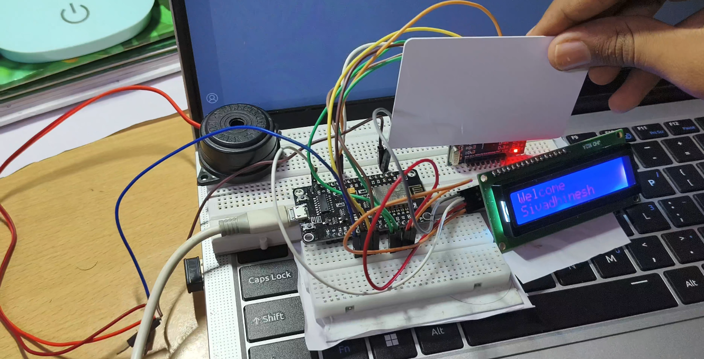

<div align="center">

# 🚀 RFID & Face Recognition Smart Campus System

### A Full-Stack IoT & AI Smart Attendance Management Platform



---


</div>

---

## 📖 The Journey: From Prototype to Production

This project serves as a showcase of scaling a system from a basic hardware prototype into a robust, enterprise-grade application. It demonstrates system design, database modeling, and the integration of Embedded Systems with modern Web Technologies.

### 🌱 Phase 1: Where We Started (The IoT Prototype)
Initially, the project was a hardware-first IoT prototype designed to replace manual roll calls.
- **Hardware:** NodeMCU ESP8266 + MFRC522 RFID reader.
- **Backend & DB:** Google Apps Script and Google Sheets.
- **Features:** Basic RFID scanning, duplicate prevention via Apps Script, and buzzer feedback.

### 🏗️ Phase 2: How We Evolved (The Full-Stack Migration)
As requirements grew, a simple spreadsheet was no longer enough. We needed role-based access control, complex analytics, and a reliable, scalable database.
- **Database Migration:** Moved from Google Sheets to a relational **MySQL** database using **Prisma ORM**.
- **REST API:** Replaced Google Apps Script with a scalable **Node.js/Express** backend.
- **Hardware Upgrade:** Shifted firmware focus to **ESP32** for better peripheral management, moving from Google Sheets integrations to custom REST API payloads.

### 🚀 Phase 3: Where We Are Now (Enterprise Smart Campus)
The system is now a complete ecosystem serving Students, Faculty, and Administrators.
- **Multi-Modal Attendance:** Integrated a **Python-based Face Recognition** system alongside physical RFID scanners.
- **Web Dashboard:** Built a highly responsive **Next.js + Tailwind CSS** frontend portal.
- **Real-Time Telemetry:** Implemented Server-Sent Events (SSE) for live attendance streaming and IoT device monitoring.
- **Advanced Workflows:** Automated On-Duty (OD) request lifecycles, timetable management, automated PDF/CSV report generation, and predictive attendance analytics.

---

## 🏗️ System Architecture

```text
 ┌────────────────┐       ┌─────────────────┐       ┌────────────────┐
 │ IoT Hardware   │       │  Face AI Script │       │ Web Dashboard  │
 │ (ESP32 + RFID) │       │    (Python)     │       │   (Next.js)    │
 └──────┬─────────┘       └────────┬────────┘       └───────┬────────┘
        │ (REST API)               │ (REST API)             │ (REST API / SSE)
        ▼                          ▼                        ▼
 ┌───────────────────────────────────────────────────────────────────┐
 │                       Node.js / Express Backend                   │
 │   - JWT Auth   - Role Guards   - SSE Live Streams  - Analytics    │
 └─────────────────────────────────┬─────────────────────────────────┘
                                   │ (Prisma ORM)
                                   ▼
 ┌───────────────────────────────────────────────────────────────────┐
 │                           MySQL Database                          │
 │  (Users, Attendance, Sessions, Devices, Timetables, OD Requests)  │
 └───────────────────────────────────────────────────────────────────┘
```

---

## 🛠️ Technology Stack

| Category | Technologies Used |
|----------|-------------------|
| **Frontend** | Next.js, React, Tailwind CSS, TypeScript |
| **Backend** | Node.js, Express.js, Server-Sent Events (SSE) |
| **Database & ORM** | MySQL, Prisma ORM |
| **IoT / Hardware** | ESP8266 / ESP32, MFRC522 RFID, C++ (Arduino IDE) |
| **AI / Biometrics**| Python, OpenCV, `face_recognition` |
| **Simulation** | Wokwi |

---

## ✨ Key Features

1. **Multi-Factor Attendance**: Mark attendance via physical RFID cards or AI-based Face Recognition.
2. **Role-Based Access Control (RBAC)**: Distinct dashboards and permissions for Students, Faculty (HOD/Dean), and Admins.
3. **Real-Time Live Tracking**: SSE-powered live class attendance streams (see attendance marked in real-time on the dashboard).
4. **Hardware Telemetry**: Monitor IoT turnstiles and scanners' online status, heartbeats, and firmware versions directly from the web dashboard.
5. **Analytics & Predictions**: Mathematical attendance tracking calculating streaks, safe misses, and classes required to hit the 75% threshold.
6. **OD (On-Duty) Lifecycle**: Digital workflows for students to request OD, featuring Faculty and Admin multi-level approvals.
7. **Data Export & Reporting**: Downloadable PDF and Excel (CSV) attendance statements generated securely on the server.

---

## 🚀 Getting Started

### 1. Database Setup
```bash
cd backend
npm install
npx prisma generate
mysql -u root < prisma/schema.sql
mysql -u root smart_campus_attendance < prisma/seed.sql
mysql -u root smart_campus_attendance < prisma/seed-admin.sql
```

### 2. Start the Backend (Node.js)
```bash
# In the backend directory
cp .env.example .env # (Update with your DB credentials)
npm run dev
```

### 3. Start the Frontend (Next.js)
```bash
cd frontend
npm install
cp .env.local.example .env.local
npm run dev
```

### 4. Run Hardware & AI
- **Hardware:** Flash the firmware in the `firmware/` directory to an ESP32 or ESP8266 via Arduino IDE.
- **AI Face Recognition:** Navigate to `face-recognition/`, install Python requirements, and run `code.py`.

---

## 📂 Repository Structure

```text
RFID-Smart-Attendance-System
│
├── frontend/             # Next.js Web Dashboard
├── backend/              # Node.js/Express REST API
├── face-recognition/     # Python Face Recognition Module
├── firmware/             # ESP32/ESP8266 Arduino Source Code
├── hardware/             # Circuit Diagrams & Wiring Docs
├── wokwi/                # Online Simulation Configurations
└── README.md             # Project Documentation
```

---

<div align="center">
<i>Built to demonstrate the integration of Embedded Systems, AI, and Modern Web Architectures.</i>
</div>